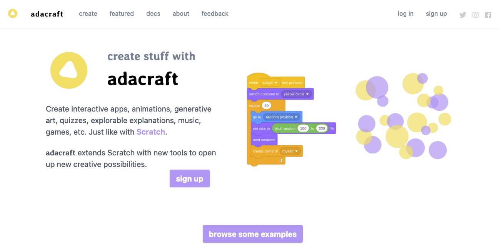

(Programming_with_AI)=
# 5. Utiliser une IA dans un programme

## Aperçu

|||
:--- | :--- |
|Âge |10 à 14 ans|
|Notions abordées|Intelligence artificielle, classification d'images, programmation avec Scratch, condition, boucle.|
| Durée| 4 heures|
| Dispositif pédagogiques| Par groupe de 2|

**Objectif:** Faire parler le rover Fetch pour qu'il dise ce qu'il voit avec sa caméra.

Le programme Scratch final est illustré dans l'image animée ci-dessous. Le sprite du rover Fetch dit s'il détecte un tube (ou rien) sur l'image qui est présentée à la caméra.  

 

**Matériel** 

* Un laptop/tablette par groupe de 2, avec connexion à Internet|

## Adacraft

Cette activité utilise Adacraft, qui est une version modifiée de Scratch incluant des extensions pour l'intelligence artificielle. Nous utiliserons dans cette activité les extensions 'Détection Vidéo' et 'AdaVision'. L'extension 'Détection Vidéo' permet d'afficher les images venant de la caméra, et de détecter le mouvement. L'extension 'AdaVision' permet d'importer un modèle de reconnaissance d'image de la Google Teachable Machine, et d'associer des actions en fonctions de l'image reconnue à la caméra. 

## Créer un projet Adacraft

Rends-toi sur le site d'Adacraft: [https://www.adacraft.org](https://www.adacraft.org), puis clique sur 'Create' en haut à gauche. 

 

Si tu n'es pas inscrit, un message apparaîtra t'informant que ton travail ne pourra pas être sauvegardé. Il est intéressant de t'inscrire sur le site (en cliquant sur 'Sign up') pour pouvoir sauvegarder tes programmes. Si tu souhaites juste tester l'interface, clique sur 'Start creating without online saving'. Tu pourras dans tous les cas sauvegarder ton travail en le téléchargeant sur ton ordinateur.

Une fois ce message validé, tu arriveras sur l'interface du *studio* dans lequel tu pourras créer tes programmes. 

 

Tu peux choisir la langue en cliquant sur l'icône de planète en haut à gauche.

## Fais parler l'étoile

Par défaut, le sprite affiché sur la scène est celui de l'étoile. Pour la faire parler, tu vas utiliser le bloc 'Dire ...' qui se trouve dans la zone d'instruction à gauche, dans la catégorie 'Apparence'. 

Déplace le bloc 'Dire Bonjour' dans la zone du programme. Si tu cliques sur ce bloc, tu verras l'étoile dire 'Bonjour'. 

 

Tu vas maintenant faire démarrer ce programme en cliquant sur le drapeau vert (au dessus- de la scène) plutôt qu'en cliquant sur le bloc. Pour cela, sélectionne le bloc 'Quand drapeau vert est cliqué' qui se situe dans la catégorie événements de la zone d'instructions, et place le au-dessus du bloc 'Dire Bonjour'. Tu pourras démarrer le programme en cliquant sur le drapeau vert au dessus de la scène, et arrêter le programme en cliquant sur le 'stop' (l'hexagone rouge). 

 

Personnalise le message de l'étoile: Change le texte dans le bloc 'Dire ...', en y ajoutant ton prénom après 'Bonjour' par exemple!

## Change l'étoile en rover martien

Tu vas maintenant remplacer l'étoile par un rover martien comme celui ci-dessous:

 

Tu peux télécharger l'image ici [https://github.com/lascientotheque/fetchbot-fr/raw/main/images/fetch-rover-small.jpg](https://github.com/lascientotheque/fetchbot-fr/raw/main/images/fetch-rover-small.jpg).

Pour changer l'étoile avec cette image, il faut aller dans l'onglet 'Costumes', et placer la souris sur l'icône du chat en bas à gauche ('Choisir un costume'), puis sélectionner 'importer un costume'. Sélectionne ensuite le fichier `fetch-rover-small.jpg` dans le répertoire où tu l'as téléchargé (par défaut; il s'agit du répertoire 'Téléchargements' de l'ordinateur). Reviens ensuite sur l'onglet 'Code'.

 

L'image est un peu trop grande et prend toute la scène. Réduis sa taille pour qu'elle soit plus petite, et déplace-la vers le bas de la scène. Tu peux changer la valeur de la taille dans la boite 'Taille' située sous la scène. Choisis une taille de '30', puis déplace l'image vers le bas en la sélectionnant avec la souris et en la plaçant un peu plus bas. 

 

Tu peux maintenant relancer le programme avec le drapeau vers, c'est Fetch qui te dira bonjour!

## Conditions et boucles

Fais maintenant réagir ce que dit le rover en fonction de la position de la souris:

* Si la souris est proche du sprite de rover, alors le rover dit 'La souris est proche de moi!'
* Si la souris est loin du sprite du rover, alors le rover dit 'La souris est loin de moi!'

Le logigramme correspondant à ce programme est donné ci-dessous:

 

Lorsque le programme est lancé, on teste d'abord si la souris est proche du rover (une distance inférieure à 100 pixels). Si oui, alors le programme affiche 'La souris est proche de moi!'. Ensuite on teste si la souris est loin du rover (une distance supérieure à 100 pixels). Si oui, alors le programme affiche 'La souris est loin de moi!'.

Pour programmer ce logigramme en Scratch, utilise un bloc de condition 'si ... alors' qui se trouve dans la catégorie 'Contrôle', un bloc de comparaison '... = ...' qui se trouve dans la catégorie 'Opérateurs', et un bloc qui donne la distance entre la souris et le sprite, qui se trouve dans la catégorie 'Capteurs'.

Voici le programme à obtenir:

 

Essaye de le faire par toi-même. Si jamais tu ne trouves pas un bloc, regarde ci-dessous le détail pas-à-pas de ce qu'il faut faire:

 

Si tu lances le programme en cliquant sur le drapeau vert, le rover dira toujours 'La souris est loin de moi !'. En effet, le programme se termine tout de suite après que tu as cliqué sur le drapeau, et de drapeau est loin du rover.

Pour changer cela, ajoute une boucle pour que le programme se répète indéfiniment. Le logigramme est modifié comme suit: Il n'y a plus de fin, et on revient au premier test lorsque l'on a terminé le deuxième test:

 

Pour faire cela dans Scratch, ajoute un bloc 'Répéter indéfiniment' (qui se trouve dans la catégorie 'Contrôle') pour inclure les autres blocs.

Voici le programme à obtenir:

 

Et ici le détail pas-à-pas pour obtenir ce programme.

 

Maintenant, si tu cliques sur le drapeau vert, tu verras le texte changer lorsque tu approches la souris du sprite!

## Activation de la caméra et détection de mouvement

Tu vas maintenant faire un programme très similaire. Au lieu de détecter si la souris est proche du rover, le programme détectera s'il y a du mouvement devant la caméra au niveau du rover.

### Activation de la caméra

Tu dois tout d'abord activer la caméra. 

Les blocs de programmation pour la caméra et la détection de mouvement se trouvent dans une extension. Pour y accéder, il faut cliquer sur l'icône en bas à gauche 'Ajouter une extension'. Ceci t'amènera à une page avec toutes les extensions disponibles. Descend dans la page pour trouver l'extension 'Détection vidéo' et clique dessus. Tu pourras voir l'extension dans la zone d'instructions.

Le navigateur te demandera s'il peut accéder à la caméra. Autorise-le. Tu verras alors la vidéo venant de la caméra s'affichera en arrière-plan dans la scène.

 

### Contrôle de la caméra et de la transparence

Il est possible d'allumer et d'éteindre la caméra grâce au bloc 'Vidéo', et choisir la transparence grâce au bloc 'Mettre la transparence vidéo sur ...'. 

Place les deux bloc l'un sur l'autre dans la zone de programmation. Tu peux changer les valeurs pour le bloc vidéo de façon à allumer ou éteindre la caméra. La transparence peut être changée avec le bloc 'Mettre la transparence vidéo sur ...' en changeant la valeur, qui doit être entre 0 et 100. 0 est correspond à l'image de caméra, et 100 à une image transparente (on ne la verra plus).

Voici les deux blocs à ajouter:

 

Tu peux ensuite allumer et éteindre la caméra en cliquant sur le bloc 'Vidéo'. 

 

Une transparence de 50 est un bon choix, mais fais tes propres tests!

### Détection de mouvement

La détection de mouvement sur un sprite peut être ajouté au programme grâce au bloc 'Vidéo mouvement sur sprite' de l'extension 'Détection vidéo'.

Modifie le programme écrit précédemment en:

* Remplaçant les blocs 'distance de pointeur de souris' par les bloc 'Vidéo mouvement sur sprite'
* En changeant la valeur 100 en 20 (le seuil de détection de mouvement est compris entre 0 et 100)
* En changeant le texte pour faire dire au rover s'il voit du mouvement devant lui ou pas. Utilise le bloc 'Dire ... pendant ... seconds', avec les textes 'Je détecte du mouvement!' quand le seuil de détection est supérieur à 20, et 'Je ne détecte pas de mouvement !' lorsque le seuil de détection est inférieur à 20. Affiche le texte pendant 1 seconde. 

Voici le programme à obtenir:

 

Le rover peut maintenant détecter lorsque quelque chose bouge devant lui et le dire!

 

Tu peux changer le seuil de détection de mouvement pour modifier la sensibilité de la détection.

(IR_Scratch)=
## Reconnaissance d'images avec le modèle Teachable Machine

Programme maintenant le rover avec de la reconnaissance d'images. Tu utiliseras pour cela un modèle de prédiction que tu auras créé auparavant avec la Teachable Machine (Activité 1).

### Ajout de l'extension AdaVision et chargement du modèle

Pour la reconnaissance d'image, tu auras besoin de l'extension AdaVision. Comme pour la détection de mouvement, va dans les extensions Adacraft, et sélectionne l'extension 'AdaVision'. L'extension contient des blocs pour charger un modèle de reconnaissance d'images, et pour ensuite détecter ce qui se trouve dans une image. 

Le bloc pour charger un modèle est le premier dans la catégorie 'AdaVision', qui s'appelle "Sélectionner et initialiser le modèle dont 'lURL est ...". Sélectionne le et place le juste après le bloc "Quand le drapeau est cliqué". 

 

Remplace ensuite l'URL avec celle du modèle de reconnaissance de tube que tu as créé dans l'activité 1. 

### Détection de tubes

Le programme pour la détection de tube est très similaire à celui pour la détection de mouvement: Au lieu de tester s'il y a du mouvement devant la caméra, tu testeras si un tube est présent. Cela donne le logigramme suivant:

 

Modifie le programme de détection de mouvement comme suit:

* Ajoute un bloc "Lancer la détection sur l'image de la webcam" après le bloc "Répéter indéfiniment"
* Dans le conditions, utilise des blocs de comparaisons d'égalité "... = ..." pour tester si l'image reconnue est un tube, ou autre chose
* Dans les blocs de comparaison, tu mettras à gauche le bloc "Classe détectée", et à droite la classe "Tube", ou "Autre".
* Change le texte de ce que le rover en fonction de ce qui est détecté. Par exemple, 
    * "J'ai détecté un tube !" lorsque la classe détectée est "Tube", et 
    * "Je ne détecte rien..." lorsque la classe détectée est "Autre". 

Voici le programme à obtenir:

 

Attention: Dans le bloc "Sélectionner et initialiser le modèle dont l'URL est ...", c'est l'URL du modèle que tu as créé qu'il faut mettre!

Lance ensuite le programme. Ton rover peut maintenant détecter si un tube se trouve devant lui!!!

 

## Références et liens utiles

Pour apprendre Scratch:

* [Ressources Scratch de la Communauté de l'Apprentissage de l'Informatique](https://cai.community/ressource/premiers-pas-et-plus-avec-scratch/)
* ["Je découvre Scratch", vidéo de 30 minutes de la Scientothèque](https://www.youtube.com/watch?v=9zSp4_0Ig1o&t=284s)

Autres ressources:

* [Fondation La Main à la Pâte](https://www.fondation-lamap.org/node/34519)
* [CodeClub - Scratch Module 1](https://projects.raspberrypi.org/fr-FR/codeclub/scratch-module-1)
* [Fondation Raspberry - Introduction à Scratch](https://projects.raspberrypi.org/fr-FR/pathways/scratch-intro)
